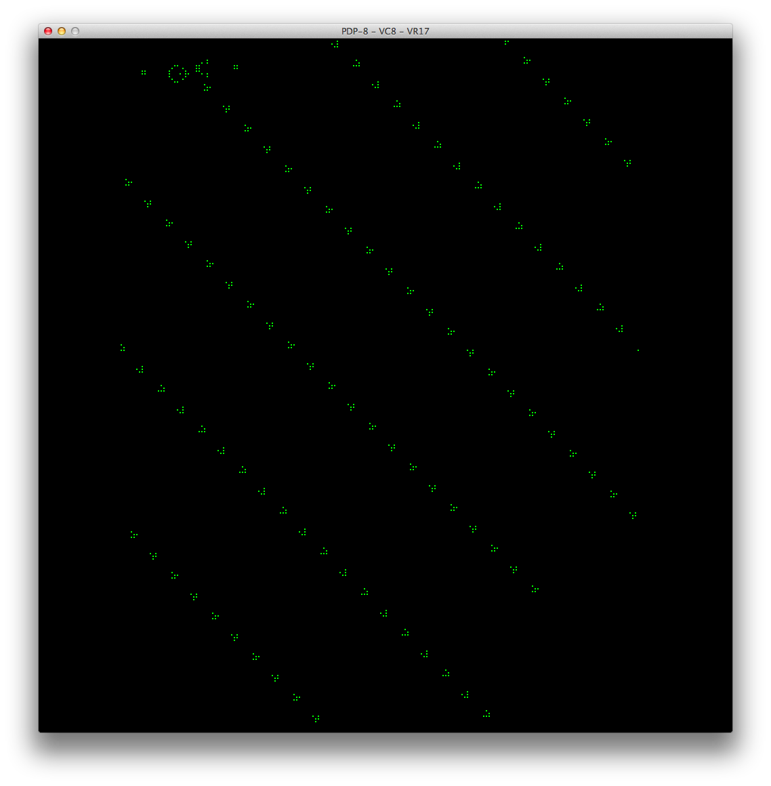
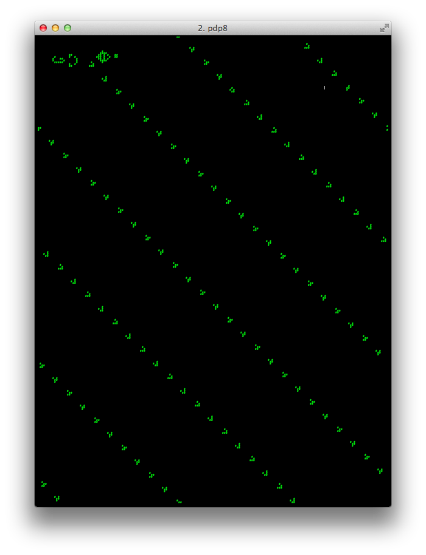

# pdp8life
Conway's Game of Life for the PDP-8

14-April-2019: Added OS/8 support  
9-April-2019: Added fast raster mode, statistics, and TTY RLE parser.  
8-April-2019: Added VC8E support for both storage and non-storage 'scopes  

Requires 8k of memory at the moment; one field for the program, and
one field for the bitmap. Will use 32k of memory if fast raster is used; 
this is still buggy and is not recommended. OS/8 support is basic at the
moment; supports CTRL-C to exit. Also, CTRL-U will now restart the 
program from the top.

VC8E is supported for both storage and non-storage oscilloscopes. In
storage mode, the screen is updated during computation of the current
playing field. In non-storage mode, the playing field is displayed as a
raster for some number of frames at the end of the playing field update.

Assembles fine with `palbart` and should assemble fine with PAL8. 
Starting address is 0200, and if you're not using the VC8E output, be sure
you're using a video terminal with the font set very small (and a square 
font cell if possible).

Several assemble-time options are available, including many initial
conditions from gliders to guns to fillers and more. The initial conditions
are all based on the standard RLE format, so adding more is very easy.
You can also assemble with a flag to take RLE input from the TTY.
